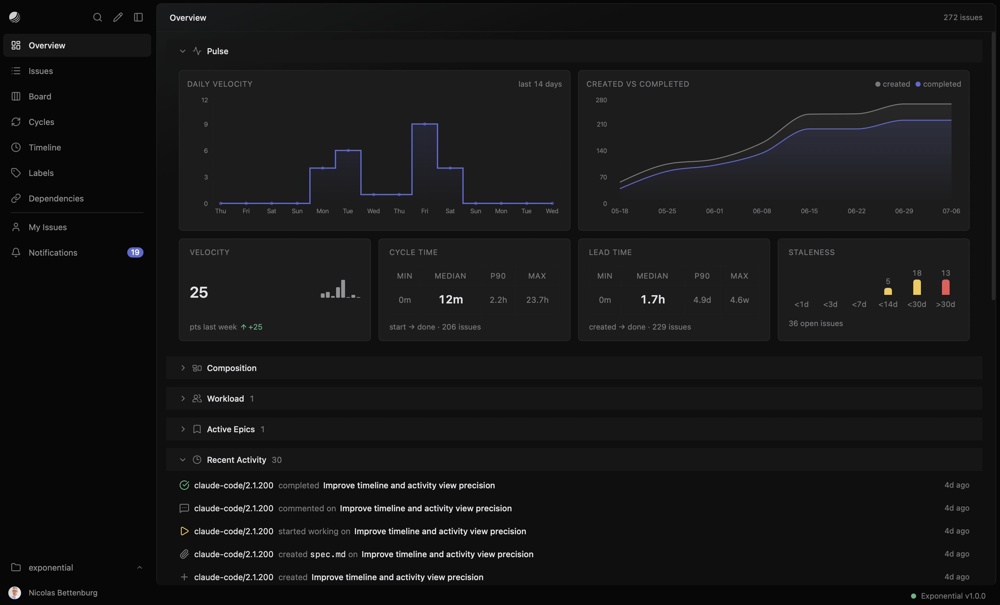

# Exponential

**The product engineering system for human-agent teams.**

Decompose problems into small, precise specs your agents can actually nail — then run the whole lifecycle, from planning to shipping, in your repo. One binary. Git-native. Bring your own agents.



## Get started

```bash
go install github.com/palarix/exponential/cmd/exponential@latest
cd your-project
xpo init
xpo add "Wire up login form" --label feature
xpo board
```

Run `xpo init` and you're tracking work in under a minute. It creates the issue database, configures `.mcp.json` for agent access, and generates agent instruction files with a portable development workflow skill for any detected agents (Claude Code, Gemini, Cursor, Aider, etc.).

## Why Exponential

**Git-native.** Issues live in `.xpo/` and travel with your code. Clone the repo, get the backlog and its full audit trail. Branches, merges, and history apply to your issues the same way they apply to everything else.

**Agent-first.** A built-in MCP server gives AI coding agents structured tools for reading, writing, linking, and driving issues. No shelling out to a CLI and praying about quoting — agents get typed tool calls with proper schemas.

**Durable memory.** A context window forgets between sessions; the backlog doesn't. Issues, comments, specs, decisions, and history persist, so the next agent picks up where the last one left off instead of starting cold.

**Event-sourced.** Every change is an append-only event. Merge conflicts are rare. The audit trail is a byproduct, not a feature you switch on.

**Single binary.** `xpo` ships the CLI, the web UI, and the MCP server in one Go executable. No Node.js, no Docker, no database to run.

## xpo drive — turn your backlog into an execution pipeline

Point `xpo drive` at your backlog. A supervisor agent evaluates your spec and reviews the result; a coder agent builds it on a branch and runs your tests. The agent that writes the code never grades its own work.

Three modes, one command:

- **Manual** — pick a story, the agent handles the rest: `xpo drive --id <id>`
- **Automatic** — the agent picks the highest-priority unblocked story: `xpo drive`
- **Continuous** — drain the backlog until everything planned is done: `xpo drive --loop`

If a run fails, the issue is marked blocked with feedback attached — nothing is lost, and you can resume where it stopped with `xpo drive --resume`.

## Agent integration (MCP)

Wire `xpo mcp` into any MCP-compatible client. The fastest setup is a `.mcp.json` at your repo root — checked in alongside the code, so every contributor gets the same tools:

```json
{
  "mcpServers": {
    "xpo": {
      "command": "xpo",
      "args": ["mcp"]
    }
  }
}
```

Agents get twelve structured tools: `list`, `show`, `add`, `update`, `comment`, `link`, `start`, `merge`, `history`, `spec`, `walkthrough`, `artifact`. All writes are append-only events on a git-tracked file, so a mistaken call is recoverable via `git`.

To reduce permission prompts in Claude Code, allow-list the tools in `.claude/settings.json`:

```json
{
  "permissions": {
    "allow": ["mcp__xpo__*"]
  }
}
```

## The Board

`xpo board` opens a Kanban board in your browser — drag-and-drop, sub-issues, keyboard shortcuts, and a `Cmd-K` command palette:

- Drag across status columns; hold `Alt` to nest as a sub-issue
- Epics show progress; children render inline
- Dashboard with velocity charts, flow metrics, cycle burndowns, workload distribution
- Inbox with grouped notifications and read/unread state
- Run multiple boards in parallel — the sidebar links to your other live projects

The server binds to `127.0.0.1` only. No remote access, no auth needed.

## CLI

### Daily workflow

```bash
xpo list                                # see the board (alias: xpo ls)
xpo show <id>                           # full details for one issue
xpo add "Title" --label feature         # create
xpo start <id>                          # move to DOING + create branch
xpo done  <id>                          # move to DONE
xpo comment <id> "Fixed in auth.go"     # markdown comment
```

### Filtering

```bash
xpo list --status PLANNED               # by status
xpo list --label bug                    # by label
xpo list --assignee "Alice"             # by assignee
xpo list --match "login"                # full-text search
xpo list --mine                         # your issues
xpo list --since 1w                     # recent activity
```

### Relationships and estimation

```bash
xpo add "Big initiative" --label epic
xpo add "Subtask" --label feature -p <epic-id>
xpo link <a> <b> --type blocks
xpo estimate <id> 5
```

### Branch workflows

```bash
xpo start <id>                          # creates branch, moves to DOING
xpo review <id>                         # unified diff from the terminal
xpo merge <id>                          # squash-merge + close
```

Run `xpo --help` or `xpo <command> --help` for the full surface.

## Installation

### Binary download

Grab the latest release from [GitHub Releases](https://github.com/palarix/exponential/releases) and put it on your `PATH`.

### Go install

```bash
go install github.com/palarix/exponential/cmd/exponential@latest
```

Requires Go 1.25+. Builds the CLI without the embedded web UI. For the full build, build from source.

### From source

Requires Go 1.25+ and [bun](https://bun.sh).

```bash
git clone https://github.com/palarix/exponential.git
cd exponential
make && make install
```

### Docker

```bash
docker build -t xpo:latest .
docker run -v /path/to/repo:/data -p 8080:8080 xpo:latest
```

## Distributed mode

For teams that need a shared server, xpo runs in client-server mode with SSH key authentication.

```bash
# Server
xpo serve --addr :8080

# Client
xpo login https://xpo.example.com
xpo list                                # works against the remote
xpo board                               # proxies to the remote
```

Add team members' SSH public keys to `.xpo/authorized_keys`. Role-based permissions (admin, member, viewer) are configured in `.xpo/config.yaml`. See `xpo serve --help` for details.

## Configuration

Settings live in `.xpo/config.yaml`, created by `xpo init`. Project settings override user-level settings in `~/.config/xpo/config.yaml`. Environment variables prefixed with `XPO_` override both.

Highlights: configurable issue ID prefix, estimation scales (fibonacci, exponential, linear, t-shirt), sprint cycles, label colors, contributor lists, automatic parent/child state propagation, and `xpo drive` agent configuration. Run `xpo config` to view or edit.

## Architecture

Issues live in `.xpo/issues.db` as an append-only JSONL event log. Reads are accelerated by a local-only snapshot that caches the projection up to a given event. The CLI, web UI, and MCP server are all thin clients over the same in-memory projection.

For the full design, see [docs/design.md](docs/design.md).

## Contributing

```bash
make           # full build (frontend + Go binary)
make cli       # Go binary only (skip frontend)
make test      # run Go tests
make lint      # go vet
```

Issues for Exponential are tracked in xpo itself. Run `xpo ls` in this repo to see what's open.

## Built with itself

We built Exponential with Exponential. One developer directing AI agents shipped the entire product as a stream of micro-tasks — 180+ issues, 90% at 3 story points or fewer, 12-minute median cycle time. The numbers on the [landing page](https://getxpo.dev) come from this repo's own `issues.db`.

## License

[MIT](LICENSE)
