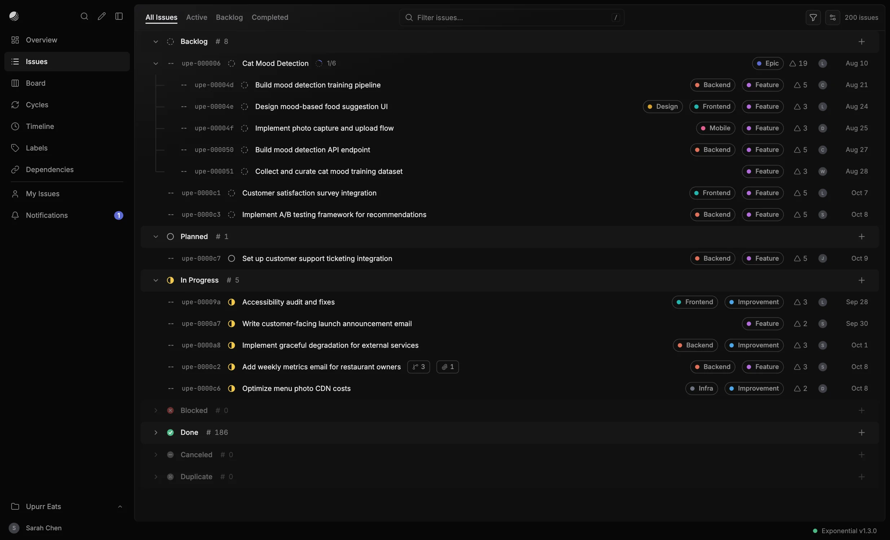

# Exponential

**The product engineering system for human-agent teams.**

Decompose problems into small, precise specs your agents can actually nail — then run the whole lifecycle, from planning to shipping, in your repo. One binary. Git-native. Bring your own agents.



## Get started

```bash
go install github.com/palarix/exponential/cmd/exponential@latest
cd your-project
xpo init
xpo add "Wire up login form" --label feature
xpo board
```

Run `xpo init` and you're tracking work in under a minute. It creates the issue database, configures `.mcp.json` for agent access, and generates agent instruction files with a portable development workflow skill for any detected agents (Claude Code, Gemini, Cursor, Aider, etc.).

## Why Exponential

**Git-native.** Issues live in `.xpo/` and travel with your code. Clone the repo, get the backlog and its full audit trail. Branches, merges, and history apply to your issues the same way they apply to everything else.

**Agent-first.** A built-in MCP server gives AI coding agents structured tools for reading, writing, linking, and driving issues. No shelling out to a CLI and praying about quoting — agents get typed tool calls with proper schemas.

**Durable memory.** A context window forgets between sessions; the backlog doesn't. Issues, comments, specs, decisions, and history persist, so the next agent picks up where the last one left off instead of starting cold.

**Concurrent by default.** `xpo start` creates isolated git worktrees so multiple agents can work on different issues in the same repo simultaneously. The primary checkout stays on `main` as the integration hub — no branch switching, no trampled work.

**Event-sourced.** Every change is an append-only event. Merge conflicts are rare. The audit trail is a byproduct, not a feature you switch on.

**Single binary.** `xpo` ships the CLI, the web UI, and the MCP server in one Go executable. No Node.js, no Docker, no database to run.

## xpo drive — turn your backlog into an execution pipeline

Point `xpo drive` at your backlog. A supervisor agent evaluates your spec and reviews the result; a coder agent builds it on a branch and runs your tests. The agent that writes the code never grades its own work.

Three modes, one command:

- **Manual** — pick a story, the agent handles the rest: `xpo drive --id <id>`
- **Automatic** — the agent picks the highest-priority unblocked story: `xpo drive`
- **Continuous** — drain the backlog until everything planned is done: `xpo drive --loop`

If a run fails, the issue is marked blocked with feedback attached — nothing is lost, and you can resume where it stopped with `xpo drive --resume`.

## Agent integration (MCP)

Wire `xpo mcp` into any MCP-compatible client. The fastest setup is a `.mcp.json` at your repo root — checked in alongside the code, so every contributor gets the same tools:

```json
{
  "mcpServers": {
    "xpo": {
      "command": "xpo",
      "args": ["mcp"]
    }
  }
}
```

Agents get fourteen structured tools: `list`, `show`, `add`, `update`, `comment`, `link`, `unlink`, `start`, `merge`, `history`, `spec`, `walkthrough`, `artifact`, `rationale`. All writes are append-only events on a git-tracked file, so a mistaken call is recoverable via `git`.

To reduce permission prompts in Claude Code, allow-list the tools in `.claude/settings.json`:

```json
{
  "permissions": {
    "allow": ["mcp__xpo__*"]
  }
}
```

## The Board

`xpo board` opens a Kanban board in your browser — drag-and-drop, sub-issues, keyboard shortcuts, and a `Cmd-K` command palette:

- Drag across status columns; hold `Alt` to nest as a sub-issue
- Epics show progress; children render inline
- Dashboard with velocity charts, flow metrics, cycle burndowns, workload distribution
- Inbox with grouped notifications and read/unread state
- Run multiple boards in parallel — the sidebar links to your other live projects

The server binds to `127.0.0.1` by default and needs no login there. Requests whose `Host` header isn't a loopback name are rejected, so web pages can't reach it through DNS rebinding.

To view a board running on another machine, forward the port over SSH:

```bash
ssh -L 8080:127.0.0.1:8080 user@host   # then open http://localhost:8080
```

`xpo board --host <addr>` binds a different address. Any non-loopback address, including `0.0.0.0`, requires a per-run access token. It is printed on startup as `http://<host>:<port>/?token=…`: open that URL, or paste the token on the `/auth` page. Traffic is plain HTTP, so prefer `ssh -L`.

## CLI

### Daily workflow

```bash
xpo list                                # see the board (alias: xpo ls)
xpo show <id>                           # full details for one issue
xpo add "Title" --label feature         # create
xpo start <id>                          # move to DOING + create worktree
xpo done  <id>                          # move to DONE
xpo comment <id> "Fixed in auth.go"     # markdown comment
```

### Filtering

```bash
xpo list --status PLANNED               # by status
xpo list --label bug                    # by label
xpo list --assignee "Alice"             # by assignee
xpo list --match "login"                # full-text search
xpo list --mine                         # your issues
xpo list --since 1w                     # recent activity
```

### Relationships and estimation

```bash
xpo add "Big initiative" --label epic
xpo add "Subtask" --label feature -p <epic-id>
xpo link <a> <b> --type blocks
xpo estimate <id> 5
```

### Worktree workflows

```bash
xpo start <id>                          # creates worktree + branch, moves to DOING
xpo review <id>                         # unified diff from the terminal
xpo merge <id>                          # squash-merge + close, removes worktree
```

`xpo start` creates a git worktree at `.xpo/worktrees/<branch>/` so the primary checkout (the hub) stays on `main`. Multiple agents (or humans) can work on different issues concurrently without trampling each other's uncommitted changes. `xpo merge` runs from the hub, which must be on the default branch, and cleans up the worktree automatically. Worktrees are the only mode: `.xpo/` is shared hub state, so it never moves with a feature branch.

Run `xpo --help` or `xpo <command> --help` for the full surface.

## Installation

### Binary download

Grab the latest release from [GitHub Releases](https://github.com/palarix/exponential/releases) and put it on your `PATH`.

### Go install

```bash
go install github.com/palarix/exponential/cmd/exponential@latest
```

Requires Go 1.25+. Builds the CLI without the embedded web UI. For the full build, build from source.

### From source

Requires Go 1.25+ and [bun](https://bun.sh).

```bash
git clone https://github.com/palarix/exponential.git
cd exponential
make && make install
```

### Docker

```bash
docker build -t xpo:latest .
docker run -v /path/to/repo:/data -p 8080:8080 xpo:latest
```

## Upgrading from 1.2.x

1.3.0 contains breaking changes. Read this before upgrading.

**1. Finish branch-mode work first** (xpo-863802). Branch mode is gone, and worktrees are the only way to work on an issue. `xpo start --mode`, `xpo merge --no-wt` and the `mode` field of the MCP `start` tool and `xpo start --json` are removed. `worktrees: false` in the config is ignored with a warning. Before upgrading:

- merge or park any issue you started in branch mode, and
- check out the default branch in the primary checkout. `xpo merge` refuses to run while it is on another branch.

**2. Re-run `xpo init` in every project.** It is now one wizard (`--yes` for CI), and `xpo init mcp` / `xpo init skill` are gone (xpo-76e2a1). It refreshes the xpo-managed blocks in CLAUDE.md / AGENTS.md and the installed skill files. Their templates changed: agents no longer assign themselves (xpo-35fc16), branch-mode wording was removed, and agents must commit before `merge` (xpo-e88f1b, xpo-c16e28). Your own content outside the managed blocks is never touched. Afterwards `xpo doctor` should report the integrations as up to date; `xpo doctor --fix` also refreshes them.

**3. `xpo board` network access** (xpo-809ad0, xpo-897f35). The board now binds `127.0.0.1` by default. If you relied on it being reachable from other machines, pass `--host` explicitly. A non-loopback `--host` requires the access token printed at startup. `ssh -L` is still the recommended way (see [The Board](#the-board)).

**4. JSON and integration changes.** If scripts or integrations read xpo output:

- `xpo history --json` prints one JSON envelope instead of JSONL (xpo-f56ce4).
- `xpo add`, `update` and `rationale --json` print `jsonio` envelopes instead of plain text, and every `--json` command reports failures as `{"error": …}` (xpo-3847a5, xpo-199282, xpo-11e559, xpo-d1a06b).
- Links are bidirectional: `A blocks B` also shows on B as `blocked_by A`, marked `derived: true` in `show`. `update { links }` replaces the issue's full relationship set, and the new `unlink` command/tool removes one link (xpo-9d6609, xpo-9d5d00).

**5. Assignees are people, not agents** (xpo-35fc16). Issues previously assigned to an agent identity (`Claude Code <agent@…>`) display as the person the agent worked for. This happens at read time, so there is no data migration. `xpo start` assigns the issue to the person, not the agent.

**6. Prefix without trailing dash** (xpo-76e2a1). The issue prefix is now stored as `pay` rather than `pay-`. Existing configs are normalised on load, so nothing to do. You may see this in a config diff after `xpo init`.

## Distributed mode

For teams that need a shared server, xpo runs in client-server mode with SSH key authentication.

```bash
# Server
xpo serve --addr :8080

# Client
xpo login https://xpo.example.com
xpo list                                # works against the remote
xpo board                               # proxies to the remote
```

Add team members' SSH public keys to `.xpo/authorized_keys`. Role-based permissions (admin, member, viewer) are configured in `.xpo/config.yaml`. See `xpo serve --help` for details.

## Configuration

Settings live in `.xpo/config.yaml`, created by `xpo init`. Project settings override user-level settings in `~/.config/xpo/config.yaml`. Environment variables prefixed with `XPO_` override both.

Highlights: configurable issue ID prefix, estimation scales (fibonacci, exponential, linear, t-shirt), sprint cycles, label colors, contributor lists, automatic parent/child state propagation, and `xpo drive` agent configuration. Run `xpo config` to view or edit.

## Architecture

Issues live in `.xpo/issues.db` as an append-only JSONL event log. Reads are accelerated by a local-only snapshot that caches the projection up to a given event. The CLI, web UI, and MCP server are all thin clients over the same in-memory projection.

For the full design, see [docs/design.md](docs/design.md).

## Contributing

```bash
make           # full build (frontend + Go binary)
make cli       # Go binary only (skip frontend)
make test      # run Go tests
make lint      # go vet
```

Issues for Exponential are tracked in xpo itself. Run `xpo ls` in this repo to see what's open.

## Built with itself

We built Exponential with Exponential. One developer directing AI agents shipped the entire product as a stream of micro-tasks — 180+ issues, 90% at 3 story points or fewer, 12-minute median cycle time. The numbers on the [landing page](https://getxpo.dev) come from this repo's own `issues.db`.

## License

[MIT](LICENSE)
